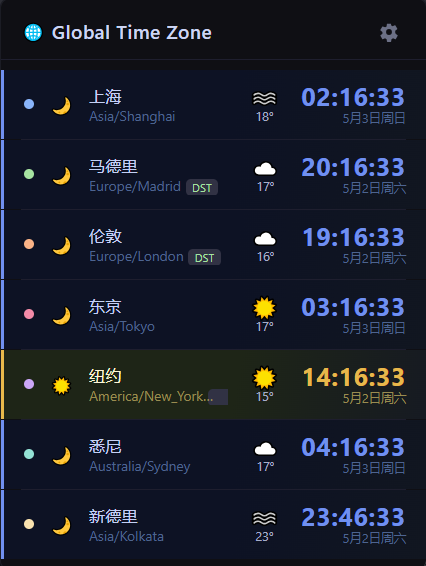

# Global Time Zone

A Chrome extension for viewing multiple world time zones with DST detection, a live toolbar clock, and optional real-time weather for each city.

## Features

- View multiple time zones at a glance with day/night theming
- Toolbar icon shows the primary time zone's current time
- DST (Daylight Saving Time) indicator
- 12h / 24h time format toggle
- **Live weather** — enter an OpenWeatherMap API key to display current weather conditions and temperature next to each city; click the weather icon to open the full forecast on openweathermap.org

## Install

1. Open Chrome and go to `chrome://extensions/`
2. Enable Developer mode
3. Click `Load unpacked`
4. Select the `GlobalTimeZone` folder

## How to Use

- Click the extension icon to open the time zone list
- Use the settings button to add, remove, or reorder time zones
- Set one time zone as the primary display (shown on the toolbar icon)
- Click any time zone row to open the matching `timeanddate.com` world clock page
- Click a weather icon (when enabled) to open the city's forecast on openweathermap.org

## Weather Setup

1. Get a free API key at [openweathermap.org/api](https://openweathermap.org/api)
2. Open the extension settings (gear icon)
3. Paste the key into the **Weather (OpenWeatherMap)** field and click **Save settings**

Weather data is cached locally and refreshed every 30 minutes.
